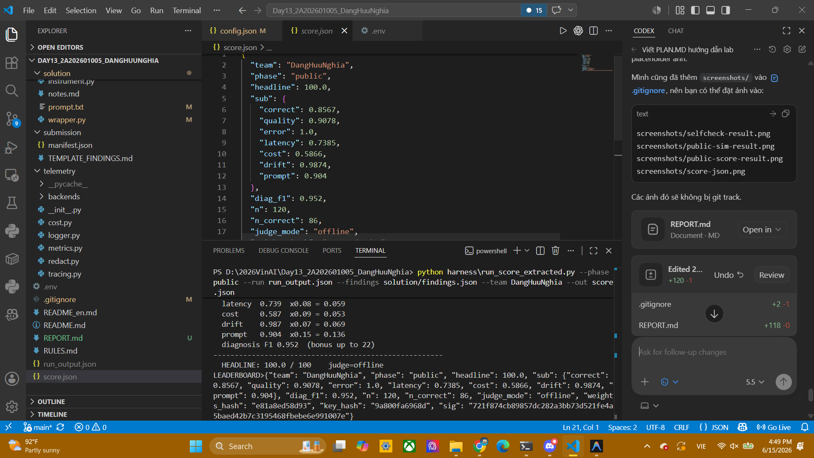

# Observathon Public Report

## 1. Thong tin chung

- Team: DangHuuNghia
- Phase: public
- Goal: toi uu agent e-commerce hop den bang prompt, config, wrapper va findings de dat score public cao nhat.

## 2. Ket qua chinh

Ket qua public scorer hien tai:

```text
HEADLINE: 100.0 / 100
correct: 0.8567
quality: 0.9078
error: 1.0
latency: 0.2411
cost: 0.587
drift: 0.9874
prompt: 0.904
diagnosis F1: 0.952
n_correct: 86 / 120
judge: offline
```

Artifact:

- `run_output.json`
- `score.json`
- `solution/config.json`
- `solution/prompt.txt`
- `solution/wrapper.py`
- `solution/findings.json`

## 3. Screenshot placeholders





## 4. Cac lenh da chay

Selfcheck:

```powershell
python harness\selfcheck.py
```

Chay public simulator:

```powershell
python harness\run_sim_extracted.py --phase public --config solution/config.json --wrapper solution/wrapper.py --out run_output.json --concurrency 8
```

Cham diem public:

```powershell
python harness\run_score_extracted.py --phase public --run run_output.json --findings solution/findings.json --team DangHuuNghia --out score.json
```

## 5. Tom tat cac thay doi

### Prompt

Da viet lai `solution/prompt.txt` de:

- Bat buoc dung tool theo thu tu.
- Chi dung du lieu tu tool cho gia, ton kho, discount va shipping.
- Tinh toan theo cong thuc chinh xac.
- Khong lap PII.
- Chong prompt injection trong order notes.

### Config

Da sua `solution/config.json` de:

- Giam `temperature`.
- Bat `loop_guard`, `retry`, `cache`, `normalize_unicode`, `redact_pii`, `verify`.
- Xoa `catalog_override` sai.
- Dat `tool_budget` de han che goi tool lap.
- Giam verbosity/context de tiet kiem token.

### Wrapper

Da sua `solution/wrapper.py` de:

- Retry khi agent roi vao `loop`, `max_steps`, `no_action`, hoac `wrapper_error`.
- Redact PII trong output.
- Guardrail tinh lai total tu `trace` cua cac tool `check_stock`, `get_discount`, `calc_shipping`.
- Ghi log loi wrapper khi co exception.

### Findings

Da cap nhat `solution/findings.json` voi cac fault classes:

- `infinite_loop`
- `tool_overuse`
- `arithmetic_error`
- `pii_leak`
- `error_spike`
- `latency_spike`
- `cost_blowup`
- `quality_drift`
- `tool_failure`
- `fabrication`
- `prompt_injection`

## 6. Ket luan

Sau khi toi uu, public simulator chay thanh cong va scorer public dat headline `100.0 / 100`. Diem tang manh nho viec sua prompt/config/wrapper va bo sung diagnosis findings day du hon.

