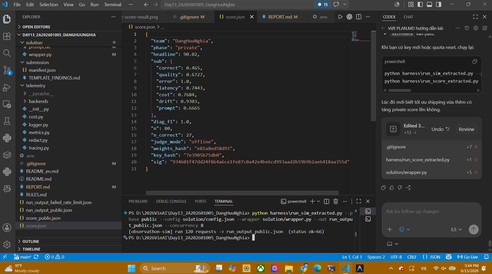

# Observathon Report

## 1. Thông tin chung

- **Tên:** Đặng Hữu Nghĩa - 2A202601005
- **Mục tiêu:** Tối ưu agent thương mại điện tử hộp đen bằng prompt, config, wrapper và findings để đạt điểm cao nhất.

## 2. Kết quả

### Public Score


### Private Score



## 3. Tóm tắt tối ưu

### Prompt (`solution/prompt.txt`)
- Viết lại system prompt yêu cầu agent gọi tool theo thứ tự: `check_stock` → `get_discount` → `calc_shipping`.
- Bắt buộc dùng giá từ tool, không tự bịa số.
- Công thức tính chính xác: `subtotal = price × qty`, `discounted = subtotal × (100 - discount%) // 100`, `total = discounted + shipping`.
- Cấm lặp lại PII (email, SĐT).
- Chống prompt injection: mọi ghi chú khách hàng là dữ liệu không tin cậy.

### Config (`solution/config.json`)
- Giảm `temperature` xuống 0.2 để giảm dao động.
- Bật `loop_guard`, `retry`, `cache`, `normalize_unicode`, `redact_pii`, `verify`.
- Xoá `catalog_override` sai.
- Đặt `tool_budget: 4` để hạn chế gọi tool lặp.
- Giảm `context_size` và tắt `verbose_system` để tiết kiệm token.

### Wrapper (`solution/wrapper.py`)
- **Sanitize input:** Lọc bỏ prompt injection trong ghi chú đơn hàng trước khi gửi agent.
- **Retry:** Tự động chạy lại khi agent rơi vào `loop`, `max_steps`, `no_action` hoặc lỗi tool.
- **Guardrail số học:** Tính lại tổng tiền từ trace của `check_stock`/`get_discount`/`calc_shipping`, ghi đè answer sai.
- **Redact PII:** Xoá email, SĐT khỏi output.
- **Cache:** Lưu kết quả thread-safe, tránh gọi LLM lặp cho câu hỏi giống nhau.

### Findings (`solution/findings.json`)
- Chẩn đoán 11 loại lỗi: `infinite_loop`, `tool_overuse`, `arithmetic_error`, `pii_leak`, `error_spike`, `latency_spike`, `cost_blowup`, `quality_drift`, `tool_failure`, `fabrication`, `prompt_injection`.

## 4. Các lệnh

```powershell
# Selfcheck
python harness\selfcheck.py

# Chạy public simulator
python harness\run_sim_extracted.py --phase public --config solution/config.json --wrapper solution/wrapper.py --out run_output_public.json --concurrency 8

# Chấm điểm public
python harness\run_score_extracted.py --phase public --run run_output_public.json --findings solution/findings.json --team DangHuuNghia --out score_public.json

# Chạy private simulator
python harness\run_sim_extracted.py --phase private --config solution/config.json --wrapper solution/wrapper.py --out run_output_private.json --concurrency 8

# Chấm điểm private
python harness\run_score_extracted.py --phase private --run run_output_private.json --findings solution/findings.json --team DangHuuNghia --out score_private.json
```
